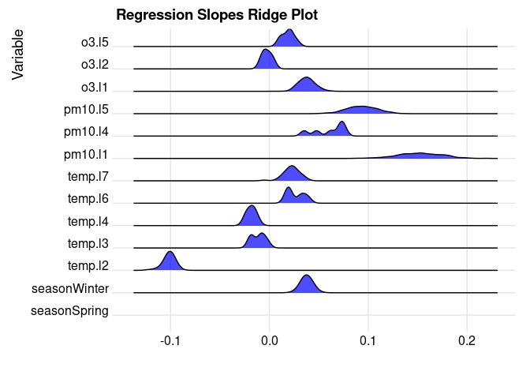

DiscreteDLM
================

<!-- README.md is generated from README.Rmd. Please edit that file -->
<!-- badges: start -->
<!-- badges: end -->

DiscreteDLM contains functionality for fitting and visualising Bayesian
Distributed Lag Models (DLMs) when the response variable is either count
or binary. More specifically, this package contains an implementation of
Bayesian quantile binary regression (for binary response data) and
negative-binomial regression (for count response data). Additionally,
these functions implement variable uncertainty inference for each
predictor.

While these functions can be applied to any standard regression problem,
the package was set up with DLMs in mind; the functions therein allow
for an easy-to-use pipeline to go from defining the DLM, fitting the
DLM, and visualising the results.

This document will provide a basic illustration of how the package is
intended to be used. For more details on DLMs and the methods we use
here, please see Dempsey and Wyse (2025).

## Installation

You can install the development version of DiscreteDLM like so:

``` r
# devtools::install_github("DanDempsey/DiscreteDLM")
```

## Using DiscreteDLM

The idea behind DLMs is that we wish to fit a regression model to data
where some of the predictors are related to the response longitudinally.
In this package we focus specifically on DLMs where the response data is
either binary or count data.

For the following examples we will be using the “chicagoNMMAPS” dataset
from the dlnm package (Gasparrini 2011). We prepare the dataset by using
the “dataframe_DLM” package, after first using the mice package (van
Buuren and Groothuis-Oudshoorn 2011) to impute missing values. The
purpose of dataframe_DLM is to define which predictors should be treated
as longitudinal (which we refer to as “dynamic variables”) and how the
effect of their lags on the response (the “lag-response”) should be
modelled:

``` r
library( DiscreteDLM )
library( mice )
#> 
#> Attaching package: 'mice'
#> The following object is masked from 'package:stats':
#> 
#>     filter
#> The following objects are masked from 'package:base':
#> 
#>     cbind, rbind
library( magrittr )

set.seed( 1000 )
X <- complete( mice(dlnm::chicagoNMMAPS) )
#> 
#>  iter imp variable
#>   1   1  rhum  pm10
#>   1   2  rhum  pm10
#>   1   3  rhum  pm10
#>   1   4  rhum  pm10
#>   1   5  rhum  pm10
#>   2   1  rhum  pm10
#>   2   2  rhum  pm10
#>   2   3  rhum  pm10
#>   2   4  rhum  pm10
#>   2   5  rhum  pm10
#>   3   1  rhum  pm10
#>   3   2  rhum  pm10
#>   3   3  rhum  pm10
#>   3   4  rhum  pm10
#>   3   5  rhum  pm10
#>   4   1  rhum  pm10
#>   4   2  rhum  pm10
#>   4   3  rhum  pm10
#>   4   4  rhum  pm10
#>   4   5  rhum  pm10
#>   5   1  rhum  pm10
#>   5   2  rhum  pm10
#>   5   3  rhum  pm10
#>   5   4  rhum  pm10
#>   5   5  rhum  pm10
#> Warning: Number of logged events: 51
N <- nrow( X )

### Create desired variables
X$dow <- as.factor( X$dow )
seasons <- c( rep('Winter', 2), rep('Spring', 3), rep('Summer', 3), rep('Autumn', 3), 'Winter' )
X$season <- seasons[X$month] %>% as.factor

### Set static and dynamic variables
X <- dplyr::select( X, c('death', 'season', 'temp', 'pm10', 'o3') )
DLM_dat <- dataframe_DLM( X, lag = 40, dynamic_vars = c('temp', 'pm10', 'o3'),
                          arglag = list(fun = 'bs', df = 7) )
```

Here, we specified that “temp”, “pm10” and “o3” should be treated
longitudinally, using the “dynamic_vars” argument. The “lag” argument
specifies the number of lags that we wish to fit to the model (in this
case, 40 time units). We use the “arglag” argument to define the
lag-response; in this case we use a b-spline with 7 degrees of freedom.
Note that, besides the response variable “death”, we also have a
variable “season” which we did not specify as a dynamic variable; this
instead will be treated as a static (i.e., non-longitudinal) in the
model, as will the intercept.

Internally, the dataframe_DLM function uses the “onebasis” function from
the dlnm package to construct the dataset; further named arguments to
onebasis can be passed through dataframe_DLM if desired.

The output of dataframe_DLM is a “dataframe_DLM” object, which R will
treat as a standard dataframe, but contains extra information that the
Bayesian fitting and visualisation functions will properly handle the
DLM components.

We will now fit the DLM model. Our response variable, “death”, is a
count variable so we will use a negative binomial regression using the
“NB_MCMC” function:

``` r
nb_fit <- NB_MCMC( death ~ ., data = DLM_dat, nsamp = 5000, nburn = 1000, thin = 10 )
#> Initializing MCMC algorithm...
#> Initialization complete. Running algorithm...
#>   |                                                                              |                                                                      |   0%  |                                                                              |                                                                      |   1%  |                                                                              |=                                                                     |   1%  |                                                                              |=                                                                     |   2%  |                                                                              |==                                                                    |   2%  |                                                                              |==                                                                    |   3%  |                                                                              |==                                                                    |   4%  |                                                                              |===                                                                   |   4%  |                                                                              |===                                                                   |   5%  |                                                                              |====                                                                  |   5%  |                                                                              |====                                                                  |   6%  |                                                                              |=====                                                                 |   6%  |                                                                              |=====                                                                 |   7%  |                                                                              |=====                                                                 |   8%  |                                                                              |======                                                                |   8%  |                                                                              |======                                                                |   9%  |                                                                              |=======                                                               |   9%  |                                                                              |=======                                                               |  10%  |                                                                              |=======                                                               |  11%  |                                                                              |========                                                              |  11%  |                                                                              |========                                                              |  12%  |                                                                              |=========                                                             |  12%  |                                                                              |=========                                                             |  13%  |                                                                              |=========                                                             |  14%  |                                                                              |==========                                                            |  14%  |                                                                              |==========                                                            |  15%  |                                                                              |===========                                                           |  15%  |                                                                              |===========                                                           |  16%  |                                                                              |============                                                          |  16%  |                                                                              |============                                                          |  17%  |                                                                              |============                                                          |  18%  |                                                                              |=============                                                         |  18%  |                                                                              |=============                                                         |  19%  |                                                                              |==============                                                        |  19%  |                                                                              |==============                                                        |  20%  |                                                                              |==============                                                        |  21%  |                                                                              |===============                                                       |  21%  |                                                                              |===============                                                       |  22%  |                                                                              |================                                                      |  22%  |                                                                              |================                                                      |  23%  |                                                                              |================                                                      |  24%  |                                                                              |=================                                                     |  24%  |                                                                              |=================                                                     |  25%  |                                                                              |==================                                                    |  25%  |                                                                              |==================                                                    |  26%  |                                                                              |===================                                                   |  26%  |                                                                              |===================                                                   |  27%  |                                                                              |===================                                                   |  28%  |                                                                              |====================                                                  |  28%  |                                                                              |====================                                                  |  29%  |                                                                              |=====================                                                 |  29%  |                                                                              |=====================                                                 |  30%  |                                                                              |=====================                                                 |  31%  |                                                                              |======================                                                |  31%  |                                                                              |======================                                                |  32%  |                                                                              |=======================                                               |  32%  |                                                                              |=======================                                               |  33%  |                                                                              |=======================                                               |  34%  |                                                                              |========================                                              |  34%  |                                                                              |========================                                              |  35%  |                                                                              |=========================                                             |  35%  |                                                                              |=========================                                             |  36%  |                                                                              |==========================                                            |  36%  |                                                                              |==========================                                            |  37%  |                                                                              |==========================                                            |  38%  |                                                                              |===========================                                           |  38%  |                                                                              |===========================                                           |  39%  |                                                                              |============================                                          |  39%  |                                                                              |============================                                          |  40%  |                                                                              |============================                                          |  41%  |                                                                              |=============================                                         |  41%  |                                                                              |=============================                                         |  42%  |                                                                              |==============================                                        |  42%  |                                                                              |==============================                                        |  43%  |                                                                              |==============================                                        |  44%  |                                                                              |===============================                                       |  44%  |                                                                              |===============================                                       |  45%  |                                                                              |================================                                      |  45%  |                                                                              |================================                                      |  46%  |                                                                              |=================================                                     |  46%  |                                                                              |=================================                                     |  47%  |                                                                              |=================================                                     |  48%  |                                                                              |==================================                                    |  48%  |                                                                              |==================================                                    |  49%  |                                                                              |===================================                                   |  49%  |                                                                              |===================================                                   |  50%  |                                                                              |===================================                                   |  51%  |                                                                              |====================================                                  |  51%  |                                                                              |====================================                                  |  52%  |                                                                              |=====================================                                 |  52%  |                                                                              |=====================================                                 |  53%  |                                                                              |=====================================                                 |  54%  |                                                                              |======================================                                |  54%  |                                                                              |======================================                                |  55%  |                                                                              |=======================================                               |  55%  |                                                                              |=======================================                               |  56%  |                                                                              |========================================                              |  56%  |                                                                              |========================================                              |  57%  |                                                                              |========================================                              |  58%  |                                                                              |=========================================                             |  58%  |                                                                              |=========================================                             |  59%  |                                                                              |==========================================                            |  59%  |                                                                              |==========================================                            |  60%  |                                                                              |==========================================                            |  61%  |                                                                              |===========================================                           |  61%  |                                                                              |===========================================                           |  62%  |                                                                              |============================================                          |  62%  |                                                                              |============================================                          |  63%  |                                                                              |============================================                          |  64%  |                                                                              |=============================================                         |  64%  |                                                                              |=============================================                         |  65%  |                                                                              |==============================================                        |  65%  |                                                                              |==============================================                        |  66%  |                                                                              |===============================================                       |  66%  |                                                                              |===============================================                       |  67%  |                                                                              |===============================================                       |  68%  |                                                                              |================================================                      |  68%  |                                                                              |================================================                      |  69%  |                                                                              |=================================================                     |  69%  |                                                                              |=================================================                     |  70%  |                                                                              |=================================================                     |  71%  |                                                                              |==================================================                    |  71%  |                                                                              |==================================================                    |  72%  |                                                                              |===================================================                   |  72%  |                                                                              |===================================================                   |  73%  |                                                                              |===================================================                   |  74%  |                                                                              |====================================================                  |  74%  |                                                                              |====================================================                  |  75%  |                                                                              |=====================================================                 |  75%  |                                                                              |=====================================================                 |  76%  |                                                                              |======================================================                |  76%  |                                                                              |======================================================                |  77%  |                                                                              |======================================================                |  78%  |                                                                              |=======================================================               |  78%  |                                                                              |=======================================================               |  79%  |                                                                              |========================================================              |  79%  |                                                                              |========================================================              |  80%  |                                                                              |========================================================              |  81%  |                                                                              |=========================================================             |  81%  |                                                                              |=========================================================             |  82%  |                                                                              |==========================================================            |  82%  |                                                                              |==========================================================            |  83%  |                                                                              |==========================================================            |  84%  |                                                                              |===========================================================           |  84%  |                                                                              |===========================================================           |  85%  |                                                                              |============================================================          |  85%  |                                                                              |============================================================          |  86%  |                                                                              |=============================================================         |  86%  |                                                                              |=============================================================         |  87%  |                                                                              |=============================================================         |  88%  |                                                                              |==============================================================        |  88%  |                                                                              |==============================================================        |  89%  |                                                                              |===============================================================       |  89%  |                                                                              |===============================================================       |  90%  |                                                                              |===============================================================       |  91%  |                                                                              |================================================================      |  91%  |                                                                              |================================================================      |  92%  |                                                                              |=================================================================     |  92%  |                                                                              |=================================================================     |  93%  |                                                                              |=================================================================     |  94%  |                                                                              |==================================================================    |  94%  |                                                                              |==================================================================    |  95%  |                                                                              |===================================================================   |  95%  |                                                                              |===================================================================   |  96%  |                                                                              |====================================================================  |  96%  |                                                                              |====================================================================  |  97%  |                                                                              |====================================================================  |  98%  |                                                                              |===================================================================== |  98%  |                                                                              |===================================================================== |  99%  |                                                                              |======================================================================|  99%  |                                                                              |======================================================================| 100%
#> Algorithm complete.
```

We specify the regression model in the usual way using a formula. The
data argument does not necessarily need to be a dataframe_DLM object,
and will work with standard dataframes if desired. As stated above, this
does not simply fit a regression model, but also includes a binary
variable inclusion parameter to infer the probability of inclusion. In
the case of negative binomial regression, the stopping parameter is also
inferred. Priors and starting values for each of these parameters can be
set through the NB_MCMC function; see the help file for more details.

The output of this function is an “MCMC_DLM” object. We can get a
summary of results using the “summary” function:

``` r
summary( nb_fit )
#> ----- Summary of Negative Binomial Regression Results -----
#> 
#>                Mean 2.5th Quantile 97.5th Quantile Probability of Inclusion
#> (Intercept)  -0.462         -0.614          -0.145                    1.000
#> seasonSpring  0.000          0.000           0.000                    0.002
#> seasonSummer  0.000          0.000           0.000                    0.000
#> seasonWinter  0.038          0.026           0.049                    1.000
#> temp.l1       0.000          0.000           0.000                    0.000
#> temp.l2      -0.102         -0.119          -0.092                    1.000
#> temp.l3       0.000          0.000           0.000                    0.010
#> temp.l4       0.000          0.000           0.000                    0.014
#> temp.l5       0.000          0.000           0.000                    0.000
#> temp.l6       0.001          0.000           0.009                    0.026
#> temp.l7       0.002          0.000           0.027                    0.090
#> pm10.l1       0.152          0.108           0.196                    1.000
#> pm10.l2       0.000          0.000           0.000                    0.000
#> pm10.l3       0.000          0.000           0.000                    0.000
#> pm10.l4       0.001          0.000           0.000                    0.012
#> pm10.l5       0.092          0.057           0.123                    0.986
#> pm10.l6       0.000          0.000           0.000                    0.000
#> pm10.l7       0.000          0.000           0.000                    0.000
#> o3.l1         0.037          0.000           0.054                    0.972
#> o3.l2         0.000          0.000           0.000                    0.006
#> o3.l3         0.000          0.000           0.000                    0.000
#> o3.l4         0.000          0.000           0.000                    0.000
#> o3.l5         0.000          0.000           0.000                    0.012
#> o3.l6         0.000          0.000           0.000                    0.000
#> o3.l7         0.000          0.000           0.000                    0.000
#> 
#> xi:
#>    Min. 1st Qu.  Median    Mean 3rd Qu.    Max. 
#>   143.2   188.9   212.6   205.9   224.1   243.0
```

We can also conveniently plot the output with “plot”. Since there are a
number of different parameters, the user needs to specify which type of
plot they would like. There are 4 options: “beta” (regression slopes),
“gamma” (variable inclusion), “xi” (negative binomial stopping
parameter - of course, not available for quantile binary regression),
and “lags” which displays the lag-response. These are all plotted using
ggplot.

type = “beta” gives a ridgeplot of each of the regression coefficients:

``` r
plot( nb_fit, type = 'beta', print_output = FALSE )
#> Picking joint bandwidth of 0.00379
```


Note that above, the intercept is not included. If you did wish to
include it, you can simply set “include_intercept = TRUE” in the
function.

type = “gamma” is a simple chart of the probability of inclusion:

``` r
plot( nb_fit, type = 'gamma', print_output = FALSE )
```


As before the intercept can also be included but note that the intercept
is assumed to have 100% inclusion by default.

type = “xi” gives a kernel density plot of the stopping parameter:

``` r
plot( nb_fit, type = 'xi', print_output = FALSE )
```


And finally, type = “lags” shows the inferred lag-response of the
dynamic variables. The function will plot the lag-response for each
variable seperately:

``` r
plot( nb_fit, type = 'lags', print_output = FALSE )
#> $temp
```


    #> 
    #> $pm10


    #> 
    #> $o3


Each of these functions returns the ggplot object that was used to print
the output (in the case of type = “lags”, the output is a list of ggplot
objects) so the user can store and edit as they see fit. If you simply
want the ggplot object without printing the graph, you can set
“print_output = FALSE” in the function (it was set this way in the code
chunks above to avoid each plot being displayed twice in the file).

This covers the basic explanation of package functionality. In the case
of binary data, you can use the “QB_MCMC” function to fit a quantile
binary model in much the same way as we used NB_MCMC to fit a negative
binomial model. In this case there is no stopping parameter, but the
quantile must be specified. “quantile = 0.5” corresponds to median
regression, for example. Please see the help file for more details.

## References

Daniel Dempsey and Jason Wyse. 2025. “Bayesian Variable Selection in
Distributed Lag Models: A Focus on Binary Quantile and Count Data
Regressions.” <https://doi.org/10.48550/arXiv.2403.03646>.

Antonio Gasparrini. 2011. “Distributed Lag Linear and Non-Linear Models
in R: The Package dlnm.” Journal of Statistical Software 43 (8): 1–20.
<https://doi.org/10.18637/jss.v043.i08>.

Stef van Buuren and Karin Groothuis-Oudshoorn. 2011. “mice: Multivariate
Imputation by Chained Equations in r.” Journal of Statistical Software
45 (3): 1–67. <https://doi.org/10.18637/jss.v045.i03>.
